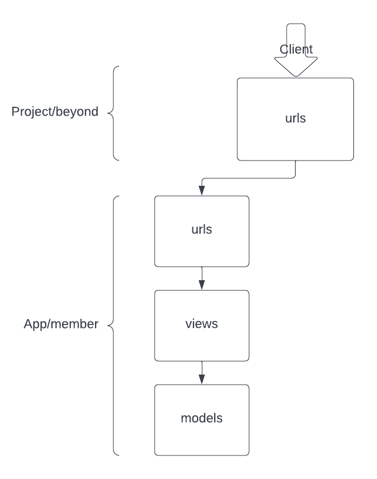
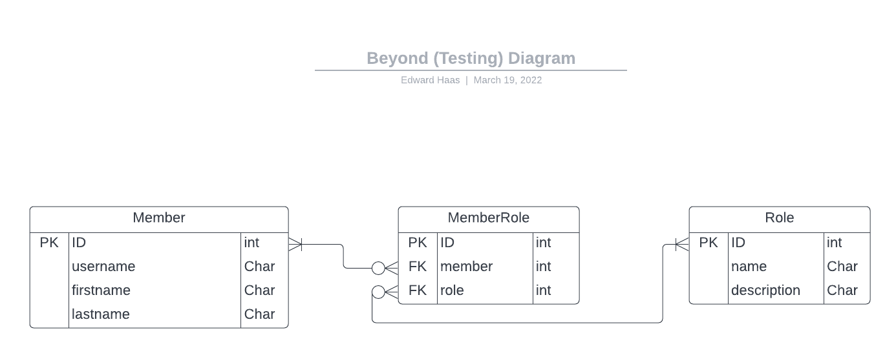

# Django Testing Tutorial

## Summary
Implement a minimal Django project to demonstrate its development
steps, focusing on testing.

## Motivation
The classic methods of teaching usually involve presenting theoretic
knowledge to students with optional examples.

Students may have hard time to grasp how to connect the theory to
actually working on such a project, especially if they had no prior
practical experience.

To mitigate the gap, mentors need to invest time in helping individual
students to pick strategies and apply them in the field.

This tutorial project is aimed to help transfer the practical aspects
of working on a project.

### Goals
- Build a functional simple Django project with **tests**.
- Actively interact with students, requiring their participation.
- Cover topics that are required in an open-source environment:
  - Working with Git.
  - Working with GitHub Pull Requests (PR).
    - Reviewing PR/s: commenting, requesting changes and approving.
    - Posting PR/s: Fixing or suggesting enhancements.
    - Consuming a PR code base.
- Learn about tests in general and pytest in particular.
- Recognize the importance of CI.

### Non Goals
- Learn Python
- Learn Django
- Learn PyTest

## Proposal

### Definition of Users
- Students

### User Stories

## API

## Design Details
The project is minimalistic to allow students to focus on development
strategies and less on the mechanics of the Django framework and the
pytest testing framework.

### Components
The project structure is tightly coupled to the Django framework,
exposing its basic components.

### Database Model
The DB model for the `member` application is described in the following
diagram:

### Flows

## Implementation Phases
In a classic application development, each phase aim to deliver
a working solution which can be consumed by users.

In this tutorial based project, we will aim for smaller steps,
each resulting in a merged change.

The table below lists development steps a team can take, mentioning
which steps can be executed in parallel.

| Step                          | Parallel | Remark                |
|-------------------------------|----------|-----------------------|
| New Repo                      |          |                       |
| Containerized env             |          | with alias            |
| Setup noop action             |          |                       |
| Add formatter                 | P01      | black                 |
| Add linter                    | P01      | flake8                |
| Add pytest noop test          | P01      |                       |
| Start new Django Project      | P01      |                       |
| Start new Django App          |          | with `Member` table   |
| Add the `Role` table          |          |                       |
| Add the `MemberRole` table    |          |                       |
| Add filter logic to model     | P02      | Filter MR by member   |
| Add filter logic to model     | P02      | Filter MR by role     |
| Add validation logic to model | P02      |                       |
| Add *hello world* view        | P02      | Expose to entry point |
| Add view to serve the model   | P02      | Not exposed           |
| Expose app view               |          | List member-roles     |
